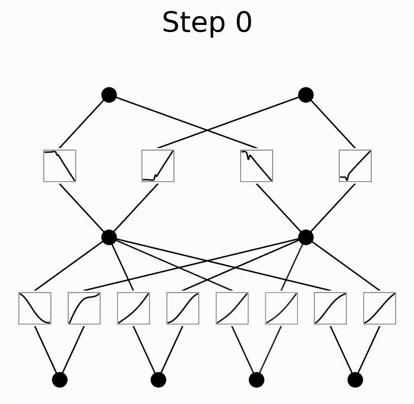

# Symbolic KAN Approach for Extracting Discrete White-Box Models for a Specific Elementary Vector Transition in 3 Phase PMSM

This repository contains the implementation accompanying the research paper "Symbolic Kolmogorov-Arnold Networks for Interpretable Modeling of Electric Motors". In this study, we present the first application of **Kolmogorov-Arnold Networks (KANs)** combined with **symbolic regression** to extract interpretable, discrete white-box models for the **three-phase Permanent Magnet Synchronous Motors (PMSMs)** dataset.  A single  model from the 49 possible models from variant C is targeted in which the elementary vector transition is $n_{k-1}=3,n_k=2$. This implementation utilizes pykan library version 0.0.5 .

Uilizing a minimal KAN architecture of the form [4,2,2] with a grid number equal to 2 and polynomial degree k equal to 3 to learn the mapping $\{I_{d,k}',I_{q,k}',cos(\varepsilon_k)',sin(\varepsilon_k)'\} \to \{I_{d,k+1},I_{q,k+1}\}$ as illustrated bellow.

For future extentions to other variants or models :
- **viz.ipynb:** For basic data exploration and visualization.
- **sampling.ipynb:** For data sampling and balancing.
- **tensor_preparation:** for storing training and testing tensor data in "Data/" folder as .pt file.
- **training.ipynb:** for the training of the KAN model, which is stroed within "Model/" folder as .pth file.
- **pruning.ipynb:** for optimizing the KAN architecture.
- **symbolic.ipynb:** for extracting the symbolic expression for each spline function.
- **evaluation.ipynb:** for comparing the performance of the extracted white-box modela and the trained KAN on the test input.

