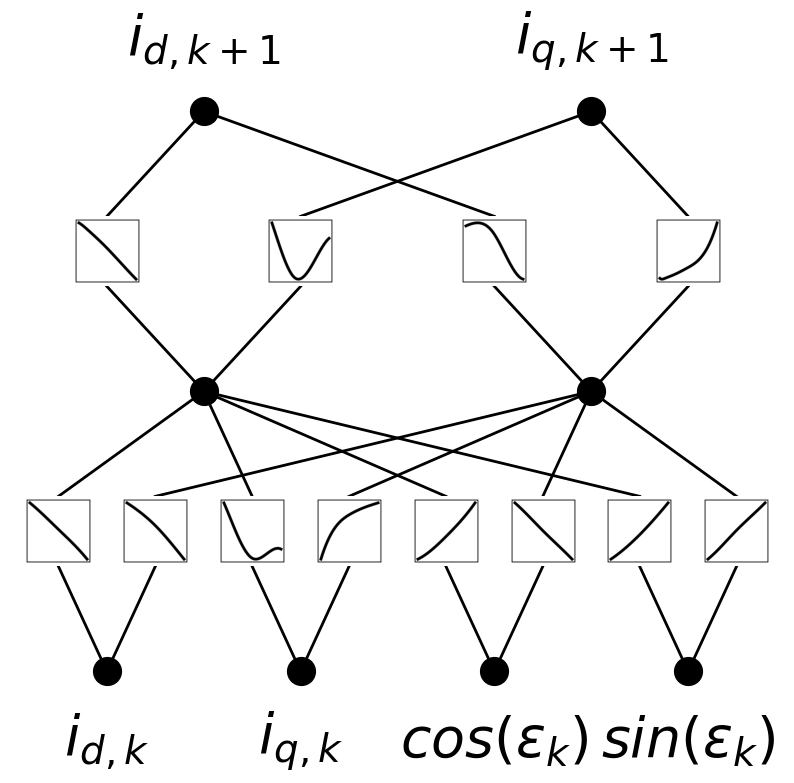

# Symbolic KAN Approach for Extracting Discrete White-Box Models for a Specific Elementary Vector Transition in 3 Phase PMSM

This repository contains the implementation accompanying the research paper "Symbolic Kolmogorov-Arnold Networks for Interpretable Modeling of Electric Motors". In this study, we present the first application of **Kolmogorov-Arnold Networks (KANs)** combined with **symbolic regression** to extract interpretable, discrete white-box models for the **three-phase Permanent Magnet Synchronous Motors (PMSMs)** dataset.

